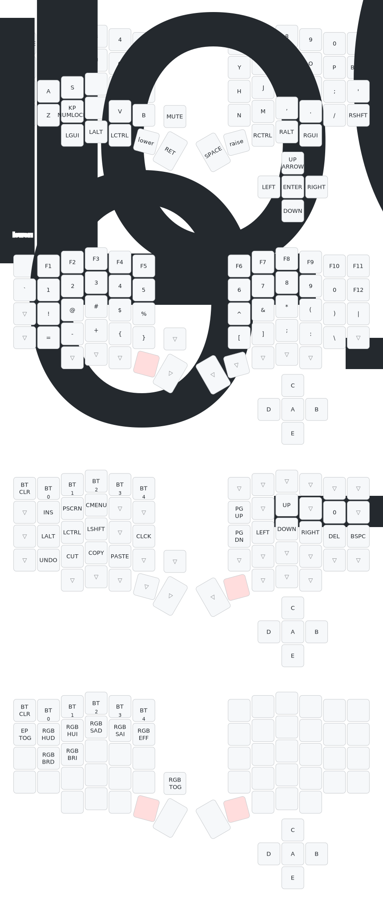

# The Sofle hybrid is now fully supported by ZMK Studio
The sofle Hybrid now can work with zmk studio. 
Here is how you can use it: visit https://zmk.studio/ using Edge or Chrome.
Locate the `studio_unlock` button (in this case, it's on the top left conner of the `lower` layer, you can see the keymap below to see it).
Press that and you can now remap the keyboard live without having to reflash the keyboard. Note that you will need to plug the usb cable while changing the keymap, it's not working over bluetooth.

# Sofle Hybrid Keyboard Guide
This guide is for flashing the Ergomech Sofle Hybrid Keyboard. The Sofle Hybrid is 6×4+5 keys column-staggered split keyboard, using low profile Kailh Choc switches.
Ergomech has modified the original Sofle Hybrid to include a 5 way switch on the right side keyboard instead of a rotary encoder.

# ErgoMech Sofle Hybrid Wireless
The Ergomech Sofle Hybrid Wireless uses a Nice!Nano microcontroller and runs the ZMK firmware. This guide will show you how to flash the ZMK firmware to the Nice!Nano microcontroller.

## Default keymap
The default keymap of this keyboard can be found here:

## Flashing the Sofle Hybrid
The ZMK cli tool would typically have you step through several questions to generate the necessary code to flash the firmware then upload it to a new repository on GitHub.
However, Ergomech has already done this for you. You can find the repository [here](https://github.com/ergomechstore/sofle-hybrid-ergomech). Assuming you already have a GitHub account,
you can fork the repository, and make modifications to the keymap files in the future. For now, the guide will continue with the assumption that you have forked the repository.

### Running the Workflow
The repository has a GitHub workflow that leverages the zmkfirmware/zmk repository to build the firmware. The workflow will build the firmware and upload it as an artifact to the repository.
The workflow is triggered on push, pull_request, and manually via workflow_dispatch. You can trigger the workflow manually by going to the Actions tab in your forked repository and selecting the workflow.

### Workflow Artifact
Once the workflow has completed, you can download the artifact from the Actions tab. The artifact will be a .zip file that contains the firmware. Extract the .zip file in your
local directory. The extracted files will include:
- `sofle_right-nice_nano_v2-zmk.uf2`
- `sofle_left-nice_nano_v2-zmk.uf2`
- `settings_reset-nice_nano_v2-zmk.uf2`

### Flashing the 'default' keymap and firmware
#### Steps to ensure successful flashing
- Keep in mind that the power switch on the wireless Ergomech Sofle Hybrid is only **one** of the ways that the keyboard can be powered. The other way is to plug in the USB-C cable.
When flashing one side of the keyboard, the other side must be off. 
- The keyboard must be in bootloader mode to flash the firmware. To enter the bootloader mode, press the "BOOT" button twice in quick succession. 
- If you are having trouble flashing, you can always flash the `settings_reset-nice_nano_v2-zmk.uf2` file first. This is a good way to make sure 
that the keyboard is in a known state before flashing the firmware. The `reset` flash can be visually confirmed by the screen on the Nice!Nano microcontroller 
not displaying anything after the flash is complete.

#### Flashing Order
There is no required order to flash the firmware. You can flash the left or right side first. Assuming that you are attempting to flash the sides with the correct
file (i.e. the right side with the `sofle_right-nice_nano_v2-zmk.uf2` file), you may find it helpful to follow the following order:
1. Confirm both sides of the keyboard are off.
2. Flash the right side of the keyboard, unplug the USB-C cable, and set it aside.
3. Flash the left side of the keyboard, leaving it plugged in after.
4. Turn on the right side of the keyboard. You should see the screen on the Nice!Nano microcontroller light up and display a checkmark next to the wifi icon if the sides have connected.
5. Open you favorite text editor and test the keyboard.

#### Flashing the firmware
1. Connect the keyboard to your computer via USB-C cable.
2. Press the "BOOT" button twice in quick succession to enter bootloader mode.
3. The keyboard should appear as a USB drive on your computer.
4. Drag and drop the `uf2` file that coincides with the side of the keyboard you are flashing onto the USB drive that represents the keyboard.
5. The keyboard will automatically reboot and the new firmware will be flashed.

**Note:** Some operating systems may show a failure when the keyboard reboots, or the USB drive may disappear. This is normal and the keyboard should be flashed successfully.
The keyboard flashing has been confirmed to work successfully on Windows 10, and Linux. 

## Modifying the keymap

### ZMK Keymap
We recommend at least reviewing the [ZMK Keymap documentation](https://zmk.dev/docs/features/keymaps) to understand the structure of the keymap files. This
will help you understand the changes we are making to the generated files. While not required, most example keymaps attempt to show the layout of the keyboard
shown as a comment underneath the layer declaration.

### ZMK Firmware
ZMK does provide an online [keymap editor](https://nickcoutsos.github.io/keymap-editor) and you can use this to change the keymap, this repo is already setup for the use of this editor. The 5 way swich can be mapped using the visual layout editor as well.

**To support the layout editor, the push button for the encoder is moved to the bottom left of the textual keymap (sofle_ergomech.keymap file), you will need to remember this if you wish to change the keymap manually**

#### Modifying the keymap with the keymap editor
- The keymap editor is configured to support the 5 way switch.
- Support for encoders will come soon, for now you can edit the function of the encoder by editing the keymap file.

#### Modifying the keymap manually
The exact spacing doesn't matter, but keeping the indentation consistent can be helpful for reading your keymap files. If you indent each button it will be easier
to confirm the structure of the keymap. Take a look at the [default keymap](config/sofle_ergomech.keymap) to see how this was done. 

The Ergomech Sofle Hybrid has a 5 way switch on the right side keyboard. The location of the key presses on the 5 way switch are on the last line of the `bindings` section of each layer.
As long as the correct number of entries exist on that row, the 5 way switch will work. 
